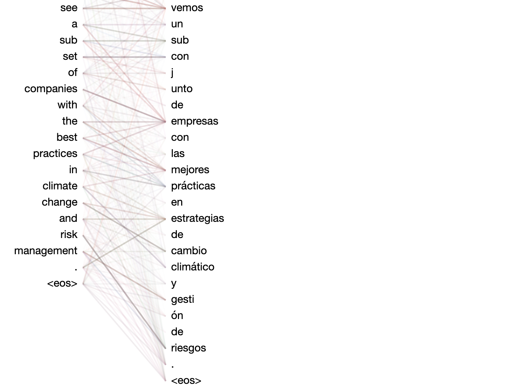

<h1>TorchNMT</h1>

[](https://www.python.org)
[](https://pytorch.org/get-started/locally/)
[](https://hydra.cc/)
[](https://pydantic.dev)
[](https://github.com/astral-sh/ruff)
[](http://mypy-lang.org/)
[](https://github.com/pre-commit/pre-commit)
[](https://github.com/snedcorp/torchnmt/actions/workflows/test.yaml)

TorchNMT traces the historical progression of sequence-to-sequence models within the Neural Machine Translation field by providing PyTorch implementations of the core ideas found within the following seminal papers:
 - [Sequence to Sequence Learning with Neural Networks (Sutskever et al. 2014)](https://arxiv.org/abs/1409.3215):
   - Introduced the foundational RNN-based encoder-decoder architecture, demonstrating the first state-of-the-art application of deep learning to machine translation.
 - [Neural Machine Translation by Jointly Learning to Align and Translate (Bahdanau et al. 2014)](https://arxiv.org/abs/1409.0473):
   - Added an attention mechanism to the RNN encoder-decoder architecture, allowing models to selectively focus on relevant parts of the input sequence during decoding.
 - [Effective Approaches to Attention-based Neural Machine Translation (Luong et al. 2015)](https://arxiv.org/abs/1508.04025):
   - Explored architectural changes and various attention mechanisms (additive, dot product, local) to determine their impact on translation quality.
 - [Attention Is All You Need (Vaswani et al. 2017)](https://arxiv.org/abs/1706.03762):
   - Introduced the Transformer architecture, which revolutionized NMT and soon became the dominant paradigm for many deep learning applications beyond translation.

Developed for educational purposes, this project implements all components in the lifecycle of an NMT model from scratch, including:
 - Dataset construction
 - Tokenization
 - RNN- and Transformer-based Seq2Seq model architectures
 - Training
 - Evaluation
 - Beam search inference

## Objective

TorchNMT aims to provide:
- A clear and accessible interpretation of NMT's historical evolution, along with many of the core concepts underpinning modern language models.

With that goal in mind, TorchNMT consistently prioritizes readability over efficiency.

In practical terms, this means that compared to a production-grade system, TorchNMT contains more object-oriented abstraction,
and lacks (for now) many of the standard performance optimization techniques that would increase code complexity.

## Features

### Dataset

- **Sources**:
  - [Tatoeba Project](https://www.manythings.org/anki/)
  - [OPUS](https://opus.nlpl.eu/):
    - TED2020
    - SciELO
- **Config options**:
  - Support for arbitrary source-to-target language pairs
  - Seamless integration of multiple datasets

### Tokenization

- **Word-level tokenization**
  - Includes normalization and filtering capabilities
- **Byte-level Byte Pair Encoding (BPE) tokenization**
  - Custom, optimized implementation with dataset-specific merges
- **Config options**:
  - Splitting pattern
  - Special tokens
  - **Word-specific**:
    - Unicode normalization
    - Regex-based filters and substitutions
  - **BPE-specific**:
    - Source and target vocabulary sizes

### RNN-based Seq2Seq Models

- **Bidirectional, multi-layer GRU encoder** implementation with support for packed padded sequences (good tutorial [here](https://gist.github.com/HarshTrivedi/f4e7293e941b17d19058f6fb90ab0fec))
- **GRU-based decoder variants**, tailored for each RNN architecture:
  - **Sutskever**:
    - Basic RNN encoder-decoder structure
  - **Bahdanau**:
    - RNN decoder with additive attention enabled
  - **Luong**:
    - RNN decoder supporting several attention mechanisms (most notably dot-product attention) and [input feeding](https://opennmt.net/OpenNMT/training/models/#default-decoder)
- **Config options**:
  - Number of layers
  - Dropout rate
  - Embedding dimensionality
  - Hidden state dimensionality
  - Attention mechanism (additive, general, dot-product, scaled dot-product)
  - Input feeding

### Transformer-based Seq2Seq Models

- **Transformer encoder**:
  - Bidirectional self-attention layers for context-rich encoding
- **Transformer decoder**:
  - Causal self-attention and cross-attention layers for effective, efficient translation
- **Config options**:
  - Number of layers
  - Dropout rate
  - Model dimensionality
  - Number of attention heads
  - Embedding layer (sinusoidal or learned)
  - Layer normalization (pre or post)
  - Multi-head attention implementation (sequential or parallel)

### Training

- **Loss reporting** for real-time feedback
- **Model checkpointing** for stopping and resuming training
- **Gradient clipping** and **teacher forcing** to improve RNN model training
- **Supported model checks**:
  - View summary of model architecture (via [torchinfo](https://github.com/TylerYep/torchinfo))
  - Overfit a single batch to ensure proper convergence before full-scale training
- **Config options**:
  - Number of epochs
  - Batch size
  - Device (`cuda` or `cpu`)
  - Learning rate
  - Checkpointing policy
  - Sampling policy
  - Gradient clipping rate
  - Teacher forcing policy

### Inference

- **Batched beam search decoder** implementations for both RNN and Transformer models
  - Includes length normalization for improved output quality
- **Config options**:
  - Batch size
  - Beam width
  - Number of generated translation candidates

### Visualizations

- **Attention heatmaps** (via [bertviz](https://github.com/jessevig/bertviz)) to visualize and intepret attention mechanisms in all attention-based models

## Experiment

To illustrate the impact that the attention mechanism and the Transformer architecture had on NMT, and deep learning in general,
four models (Sutskever, Bahdanau, and Luong RNN variants, plus a Transformer) were trained and evaluated on the same constructed translation dataset.

### Dataset

Details:
- ~510K Spanish to English translation examples sourced from Tatoeba and OPUS TED2020
- Split into a training set of ~410K examples, plus validation and test sets of ~50K each
- Tokenized using a BPE with a vocabulary of 8K tokens (that was also trained on those same translations)

### Models

The base hyperparameters of the RNN models were chosen to be exactly the same, although this still resulted in differing
parameter counts, depending on the model architecture.

Sutskever:
- Hyperparameters:
  - `n_layers=2`
  - `dropout=0.1`
  - `n_emb=256`
  - `n_hidden=512`
- Total number of parameters:
  - ~18.5 million

Bahdanau:
- Hyperparameters:
  - `n_layers=2`
  - `dropout=0.1`
  - `n_emb=256`
  - `n_hidden=512`
  - `merge_method=CONCAT`
  - `att_score_method=ADDITIVE`
- Total number of parameters:
  - ~31.2 million

Luong:
- Hyperparameters:
  - `n_layers=2`
  - `dropout=0.1`
  - `n_emb=256`
  - `n_hidden=512`
  - `merge_method=SUM`
  - `att_score_method=DOT`
- Total number of parameters:
  - ~19.1 million

The hyperparameters of the transformer model were then chosen to achieve a comparable parameter count with its RNN counterparts.

Transformer:
- Hyperparameters:
  - `n_layers=4`
  - `dropout=0.1`
  - `d_model=256`
  - `n_heads=8`
  - `d_ff=2048`
  - `pre_norm=True`
- Total number of parameters:
  - ~17.8 million

### Comparing Models

To show the importance of attention and the Transformer architecture as sequence sizes grow larger, here are five examples of increasing complexity
from the test dataset, showing each model's ability to successfully generalize what it's learned and apply it to unseen data.

#### Easy

Source:
```
Tom tomó una taza de café.
```

Target:
```
Tom drank a cup of coffee.
```

---

Sutskever:
```
Tom drank a cup of coffee.
```

Bahdanau:
```
Tom drank a cup of coffee.
```

Luong:
```
Tom drank a cup of coffee.
```

Transformer:
```
Tom drank a cup of coffee.
```
---

For short, simple sentences like this, the model architecture largely doesn't matter - each type can translate them perfectly.

#### Moderate

Source:
```
Me gustaría que fuera fácil, pero no se me da bien jugar.
```

Target:
```
I wish it were that easy, but I'm not good at playing.
```

---

Sutskever:
```
I'd like to be easy, but I don't play...
```

Bahdanau:
```
I wish it would be easy, but I'm not good good at playing.
```

Luong:
```
I wish it was easy, but I'm not good at playing.
```

Transformer:
```
I'd like it to be easy, but I'm not good at playing.
```

---

As the sentence gets larger, we now see the models start to diverge:
- Sutskever:
  - Captures most of the sentence, but misses some words and changes the meaning.
- Bahdanau:
  - Gets it mostly right, with some tense and repetition issues.
- Luong & Transformer:
  - Correct translations, both grammatically and meaning-wise.

Can see below how the Bahdanau model is able to improve on the Sutskever model - when generating each token
in the target sequence, it has learned how to selectively pay attention to specific tokens in the source sequence, based
on the tokens it's already generated.


The Luong model works similarly, but its attention scores are less diffuse and more targeted, leading to
its improved translation.


The Transformer model's attention scores are more visually complex due to its multi-layer, multi-headed nature, but it's still
clear what it's paying attention to at each output step.


#### Medium

Source:
```
De hecho, soy una, como la mayoría de los de mi generación, que no puede pagar su vivienda.
```

Target:
```
In fact, I'm one of the majority of my generation who can't afford a home.
```

---

Sutskever:
```
In fact, I am a, like most most
```

Bahdanau:
```
In fact, I'm one, like most most of my generation generation who cannot afford afford housing.
```

Luong:
```
In fact, I'm one, like most of my generation, who can't afford homeless.
```

Transformer:
```
In fact, I'm one, like most of my generation, who can't afford their housing.
```

---

Here we really start to see the limitations of the Sutskever model - due to its lack of attention, the entirety of the
source sequence and all the previously decoded target tokens have to be encoded into a single context vector at each timestep.
This is just too much of a bottleneck as sequence sizes grow, as seen in the translation above. The decoder is able to remember enough
of the source sequence to get the gist of the first few words, but after that, the signals become too decayed and it gives up.

However, the attentional models have no such constraint, and so they are able to translate the full sequence with varying
levels of success, in line with the previous example.

Bahdanau:


Luong:


Transformer:


#### Hard

Source:
```
No solo regresaron a casa a trabajar, sino que organizaron a sus comunidades para construir
el primer hospital indígena de Honduras.
```

Target:
```
They not only went to work back home, but they organized their communities to build Honduras'
first indigenous hospital.
```

---

Sutskever:
```
Not only did they go home to work work, but they they organize their communities to build the
the first
```

Bahdanau:
```
They didn not just returned home to work, but they organized organized their communities to
build the the
```

Luong:
```
Not only did they come home to work, but they they organize their communities to build the
first Higenous hospital Hondas.
```

Transformer:
```
They didn't just return home to work, but they organized their communities to build the
first indigenous hospital in Honduras.
```

---

With this example, we come to the limits of what the attentional RNN models are capable of - even though their decoders always have access
to each encoder timestep, they do still rely on hidden states to remember what has happened previously, and that can become fraught
as the sequences grow larger.

In this case, they were able to get most of the way through the source sequence with decent accuracy before the length became
too much and they either stopped prematurely (Bahdanau) or sort of flailed around a bit (Luong).

The Transformer model, however, is not recurrent by nature, and so doesn't have the same difficulties with long sequences - it's able to translate this sentence perfectly.

Bahdanau:


Luong:


Transformer:


#### Very Hard

Source:
```
En azul, vemos el rendimiento de las 500 empresas más grandes del mundo y en dorado,
vemos un subconjunto de empresas con las mejores prácticas en estrategias de cambio
climático y gestión de riesgos.
```

Target:
```
In blue, we see the performance of the 500 largest global companies, and in gold,
we see a subset of companies with best practice in climate change strategy and
risk management.
```

---

Sutskever:
```
In blue,, we the top of the world world largest
```

Bahdanau:
```
In blue, we see the performance of the  largest companies companies in the world
and golden,,
```

Luong:
```
In blue, we see the performance of the 500 companies companies and in
```

Transformer:
```
In blue, we see the performance of the 500 largest companies in the world and
in gold, we see a subset of companies with the best practices in climate change
and risk management.
```

Here, the overwhelming superiority of the Transformer model really shines, as the attentional RNN models can barely translate
half the sentence before stopping, whereas the Transformer, despite having never seen this sentence before in its training,
is able to generate a near-perfect translation.




### Translations

Below are some selected translations of test set examples for each of the models, arranged in ascending source sequence length:

#### Sutskever

| Source                                                                                                                                         | Target                                                                                                                                               | Prediction                                                                                                                              |
|------------------------------------------------------------------------------------------------------------------------------------------------|------------------------------------------------------------------------------------------------------------------------------------------------------|-----------------------------------------------------------------------------------------------------------------------------------------|
| Es una casa grande.                                                                                                                            | This is a big house.                                                                                                                                 | This is a big house.                                                                                                                    |
| Mi padre fue a China.                                                                                                                          | My father went to China.                                                                                                                             | My father went to China.                                                                                                                |
| Bueno, esto es nuevo.                                                                                                                          | Hey, this is new.                                                                                                                                    | Well, this is new.                                                                                                                      |
| Ya he hablado con Tom.                                                                                                                         | I've already spoken with Tom.                                                                                                                        | I've already talked to Tom.                                                                                                             |
| ¿Cómo lo consiguió Tom?                                                                                                                        | How did Tom get it?                                                                                                                                  | How did Tom get it?                                                                                                                     |
| Soy canadiense también.                                                                                                                        | I'm Canadian, too.                                                                                                                                   | I'm Canadian. too.                                                                                                                      |
| Sos un buen chico, Tom.                                                                                                                        | You're a good kid, Tom.                                                                                                                              | You're a good boy, Tom.                                                                                                                 |
| ¿Cómo estás estos días?                                                                                                                        | How are you these days?                                                                                                                              | How are you these days?                                                                                                                 |
| Y este fue el resultado.                                                                                                                       | And this is what they came up with.                                                                                                                  | And this was the result.                                                                                                                |
| ¿Quién quiere un helado?                                                                                                                       | Who wants an ice cream?                                                                                                                              | Who wants a ice cream?                                                                                                                  |
| Estoy feliz de verte aquí.                                                                                                                     | I'm happy to see you here.                                                                                                                           | I am happy to see you here.                                                                                                             |
| Este es un tipo de comida.                                                                                                                     | This is a kind of food.                                                                                                                              | This is a kind of food.                                                                                                                 |
| Esto no va a acabar nunca.                                                                                                                     | This is never going to end.                                                                                                                          | This is never going to end.                                                                                                             |
| «¿Te gusta la tarta?» «Sí.»                                                                                                                    | "Do you like cake?" "Yes, I do."                                                                                                                     | "Do you like the cake?" "Yes."                                                                                                          |
| Atrapé una hermosa mariposa.                                                                                                                   | I caught a beautiful butterfly.                                                                                                                      | I caught a beautiful butterfly.                                                                                                         |
| Pero a 30.500 metros mueren.                                                                                                                   | If you're at 100,000 feet you die.                                                                                                                   | But at 30,000 feet dying.                                                                                                               |
| No es oro todo lo que reluce.                                                                                                                  | All that glitters is not gold.                                                                                                                       | It's not gold everything that refine..                                                                                                  |
| Pero ahora están bajo amenaza.                                                                                                                 | But now it's under threat.                                                                                                                           | But they're now under threat.                                                                                                           |
| Pero no es lo mismo; es distinto.                                                                                                              | But it's not the same stuff; it's different.                                                                                                         | But it's not the same thing. It's different.                                                                                            |
| De acuerdo, gracias por participar.                                                                                                            | All right, well thanks for coming up.                                                                                                                | All right, thank you for participating.                                                                                                 |
| hay una pequeña diferencia ¿verdad?                                                                                                            | There is a small difference, right?                                                                                                                  | There's a small difference, right?                                                                                                      |
| Ni siquiera sé cuál es tu dirección.                                                                                                           | I don't even know your address.                                                                                                                      | I don't even know what your address is.                                                                                                 |
| Tom se enfadó cuando vio a Mary con John.                                                                                                      | Tom got angry when he saw Mary with John.                                                                                                            | Tom got angry when he saw Mary with John.                                                                                               |
| Me alegro de que me pidieras unirme a ti.                                                                                                      | I'm glad you asked me to join you.                                                                                                                   | I'm glad you asked me to join me.                                                                                                       |
| . Esto es lo que está pasando en el mundo.                                                                                                     | Here's what's happening in the world.                                                                                                                | Here is what's happening in the world.                                                                                                  |
| Entonces exploraron un arte más geométrico.                                                                                                    | So they explored a more geometric art.                                                                                                               | And then they explored a geometryical art..                                                                                             |
| Él juntó el coraje para rechazar su oferta.                                                                                                    | He gathered the courage to decline the offer.                                                                                                        | He put his courage to refuse his offer.                                                                                                 |
| De verdad quiero pasar tiempo solo con Tom.                                                                                                    | I really want to spend some time alone with Tom.                                                                                                     | I really want to spend time with alone with Tom.                                                                                        |
| Piensen, ¿cuál es nuestro miedo más profundo?                                                                                                  | Think -- what is our greatest fear growing up, even now?                                                                                             | Think, what, what our our deep fear?                                                                                                    |
| El colibrí es el pájaro más pequeño del mundo.                                                                                                 | The hummingbird is the world's smallest bird.                                                                                                        | The hib is the the smallest animal in the world.                                                                                        |
| Descubrí que mi fotografía era casi compulsiva.                                                                                                | I found this photography of mine almost compulsive.                                                                                                  | I discovered that my photograph was almost compulsive.                                                                                  |
| Ninguno de sus hijos quiso hacerse cargo del negocio.                                                                                          | Neither of his sons wanted to take over the business.                                                                                                | Neither of his children wanted to take care of the business.                                                                            |
| Así que pensé: espera un minuto, ¿qué estoy haciendo?                                                                                          | Then I thought, "Wait a minute, what am I doing?"                                                                                                    | So I thought, I expect a minute,,, what am I doing?                                                                                     |
| Me gustaría que fuera fácil, pero no se me da bien jugar.                                                                                      | I wish it were that easy, but I'm not good at playing.                                                                                               | I'd like to be easy, but I don't play...                                                                                                |
| El cuerpo del hombre es mortal, pero su alma es inmortal.                                                                                      | A man's body dies, but his soul is immortal.                                                                                                         | The body's body is mortal, but its soul is immoral.                                                                                     |
| Sin embargo, realmente no sabemos como manipularlo tan bien.                                                                                   | We don't really know how to manipulate it, though, that well.                                                                                        | However, we don't really know how manip manipulate it so well.                                                                          |
| Era muy rápido, pero no hacía un movimiento fluido, para nada.                                                                                 | I was pretty fast, but I was not fluid at all.                                                                                                       | It was very fast, but it wasn't a fluid fluid motion.                                                                                   |
| Continuaré haciendo esto, muy probablemente por el resto de mi vida.                                                                           | I will continue doing this, most probably for the rest of my life.                                                                                   | I'm going to do this, probably probably for the rest of my life.                                                                        |
| Ni un solo miembro del equipo renunció en los siguientes cuatro años.                                                                          | Not a single team member quit in the next four years.                                                                                                | Not a single member of the team gave up the the next four years.                                                                        |
| Esta tecnología aspira el aire a través de un filtro de gran volumen.                                                                          | This technology pulls air through a high-volume air filter.                                                                                          | This technology is air air air through a through a large volume..                                                                       |
| Tengo algunas ideas que compartir pero, primero, un poco de historia.                                                                          | I have a few insights to share, but first: a little history.                                                                                         | I have some ideas that I share, but, first, a little bit of a story.                                                                    |
| El cuerpo evita este problema simplemente eliminando cada posible riesgo.                                                                      | The body avoids this problem by simply removing every possible risk.                                                                                 | The body body avoids this problem is elim eliminating every risk..                                                                      |
| Con un toma desde arriba, así que lo que ven son las sombras de los camellos.                                                                  | Shot straight down, so these are the shadows of the camels.                                                                                          | With a take a of,,, what you see the the shadows of the camels.                                                                         |
| El virus infecta a otra persona cuando esas gotas entran en la nariz o la boca.                                                                | The virus can infect a new person when the droplets enter their nose or mouth.                                                                       | The virus infected someone someone when when they drops in their nose or or mouth.                                                      |
| ¿Recuerdan ese punto que mencioné que supuestamente duró dos horas y 12 minutos?                                                               | You remember that point I mentioned that was said to last for two hours and 12 minutes?                                                              | Do you remember that point I mentioned that that lasted last two two hours and 12 minutes?                                              |
| Y una de las cosas que más le gustaba hacer en ese momento era mirarse al 'espejo.                                                             | And one of her favorite things to do at the moment is to stare at herself in the mirror.                                                             | And one of the things that liked liked doing at the time was looking at the mirror.                                                     |
| Si juntamos todos los peces de un arrecife de coral y los pesamos, esto es lo que esperaríamos.                                                | If we get all of the fish of a coral reef together and weigh them, this is what we would expect.                                                     | If you put together all of fish fish the coral reef coral reefs, and we this is what we expect.                                         |
| La mayoría de la gente considera la ciencia como una caja negra cerrada, cuando de hecho es un campo abierto.                                  | Most people think of science as a closed, black box, when in fact it is an open field.                                                               | Most people think about science as a black box,                                                                                         |
| Varias civilizaciones han registrado estas explosiones de supernova mucho antes de que se inventara el telescopio.                             | Various civilizations recorded these supernova explosions long before the telescope was invented.                                                    | Acientizations have colon have these these super supernova explosions before before the discovery..                                     |
| Y usaremos todo tipo de cosas -la danza y los medios sociales, visitas en Facebook, visitas al sitio web, firmas de petición.                  | And we will utilize all kinds of things -- have a dance and social media and visiting on Facebook and visit the website, sign the petition.          | And we use all sorts of things -- and social media, social,                                                                             |
| Las voces computarizadas a veces no son muy sofisticadas. pero con mi computador puedo comunicarme más ampliamente que nunca antes.            | Computer voices are sometimes not very sophisticated, but with my computer, I can communicate more widely than ever before.                          | Dagnagnetic are are not not so sophisticated, but but my computer can communicate with more more more ever before before before. before. |                                                                                                     |
| Pero quizás lo más sorprendente es una capacidad, incluso más importante que la inteligencia, su sentido de empatía, altruismo y justicia.     | But perhaps the most amazing thing about elephants is a capacity even more important than cleverness: their sense of empathy, altruism, and justice. | But perhaps the most amazing thing is a, even more.                                                                                     |
| Después, piensen en lo que eso significa para otras decisiones de su vida y quizás también para cuestiones políticas que nos afectan a todos.  | And then think about what it also means for other decisions in your life, and hopefully also for policy questions that affect all of us.             | Then, think about what that means for some of of life, and perhaps some                                                                 |

#### Bahdanau

| Source                                                                                                                                                                        | Target                                                                                                                                                                          | Prediction                                                                                                                                                                    |
|-------------------------------------------------------------------------------------------------------------------------------------------------------------------------------|---------------------------------------------------------------------------------------------------------------------------------------------------------------------------------|-------------------------------------------------------------------------------------------------------------------------------------------------------------------------------|
| Todo está muy barato.                                                                                                                                                         | Everything's so cheap.                                                                                                                                                          | Everything is very cheap.                                                                                                                                                     |
| Apenas hablo francés.                                                                                                                                                         | I speak almost no French.                                                                                                                                                       | I can hardly speak French.                                                                                                                                                    |
| Me burlo de mí mismo.                                                                                                                                                         | So it’s a joke against myself.                                                                                                                                                  | I make fun of myself.                                                                                                                                                         |
| Tom dijo que no tomó café.                                                                                                                                                    | Tom said he didn't drink coffee.                                                                                                                                                | Tom said he didn't drink coffee.                                                                                                                                              |
| Lo que vi fue inimaginable.                                                                                                                                                   | What I witnessed was unimaginable.                                                                                                                                              | What I saw was unimaginable.                                                                                                                                                  |
| Estoy listo para ir a casa.                                                                                                                                                   | I'm ready to go home.                                                                                                                                                           | I'm ready to go home.                                                                                                                                                         |
| Dicen que nació en Alemania.                                                                                                                                                  | They say that she was born in Germany.                                                                                                                                          | They say he was born in Germany.                                                                                                                                              |
| ¿Vendrás conmigo al concierto?                                                                                                                                                | Will you come with me to the concert?                                                                                                                                           | Will you come with me to the concert?                                                                                                                                         |
| Ella cantó con una voz hermosa.                                                                                                                                               | She sang with a beautiful voice.                                                                                                                                                | She sang with a beautiful voice.                                                                                                                                              |
| Tu bicicleta es mejor que la mía.                                                                                                                                             | Your bicycle is better than mine.                                                                                                                                               | Your bicycle is better than mine.                                                                                                                                             |
| Tom se divirtió mucho en la fiesta.                                                                                                                                           | Tom really enjoyed the party.                                                                                                                                                   | Tom had a lot of fun at the party.                                                                                                                                            |
| Microsoft puede hacer muchas cosas.                                                                                                                                           | Microsoft has lots of things it can do.                                                                                                                                         | Microsoft can do a lot of things.                                                                                                                                             |
| No te acerques, estás hecho un asco.                                                                                                                                          | Don't come near me. You're filthy.                                                                                                                                              | Stay away, you're disgusting..                                                                                                                                                |
| Ella dijo: “Compré un regalo para mi mamá.                                                                                                                                    | She says, 'I bought a present for my mom.                                                                                                                                       | She said, 'I bought a present for my mom.                                                                                                                                     |
| Todos nosotros sabemos por qué hiciste eso.                                                                                                                                   | We all know why you did that.                                                                                                                                                   | We all know why you did that.                                                                                                                                                 |
| Ella debe haber sido rica en aquellos días.                                                                                                                                   | She must have been rich in those days.                                                                                                                                          | She must have been rich in those days.                                                                                                                                        |
| Yo pensaba: "Bien, eso es habilidad social".                                                                                                                                  | I was like, "Okay, that's social skill."                                                                                                                                        | I thought, "Well, that's social skill."                                                                                                                                       |
| Esto está ocurriendo en una escala increíble.                                                                                                                                 | This is happening over an unbelievable scale.                                                                                                                                   | This is happening on an incredible scale.                                                                                                                                     |
| Y ahora miren, el as de diamantes nos guiará…                                                                                                                                 | And now, look, ace of diamonds will guide.                                                                                                                                      | And now look, the diamonds will lead us ...                                                                                                                                   |
| En el momento en que me vio, se echó a llorar.                                                                                                                                | The moment she saw me, she burst into tears.                                                                                                                                    | The moment he saw me, he cried.                                                                                                                                               |
| En caso de no estar claro, quiero que hagan esto.                                                                                                                             | In case it's not clear, I really want you to do this. OK?                                                                                                                       | Should I be not clear, I want to to do this.                                                                                                                                  |
| Pero el problema era lo que representa esta imagen.                                                                                                                           | But what this image represents was the problem.                                                                                                                                 | But the problem was what this picture represents.                                                                                                                             |
| La floristería está justo al otro lado de la calle.                                                                                                                           | The flower shop is just across the street.                                                                                                                                      | The flowering is right across the street.                                                                                                                                     |
| El problema es que organizar esto no era nada fácil.                                                                                                                          | But the thing is, that is not an easy thing to pull off.                                                                                                                        | The problem is, organizing this was not easy.                                                                                                                                 |
| Así, un tipo de biomolécula podría tener un color azul.                                                                                                                       | So one kind of biomolecule might get a blue color.                                                                                                                              | So, kind of biom biomolecule might have have a blue color.                                                                                                                    |
| Y ahí es donde nuestras mentes necesitan practicar más.                                                                                                                       | And yet, that's exactly where our minds need the most practice.                                                                                                                 | And that's where our minds need to practice..                                                                                                                                 |
| Han visto la calidad de los educadores que han estado aquí.                                                                                                                   | You saw the quality of the educators who were here.                                                                                                                             | You've seen the quality of educators who have been here.                                                                                                                      |
| No traten de cambiarlo o incluso de querer que sea diferente.                                                                                                                 | Let go of trying to change it or even wanting it to be different.                                                                                                               | Try not to change it or even want it to be different.                                                                                                                         |
| Pero por sí sola es un instrumento débil para el progreso moral.                                                                                                              | But all on its own, it's a feeble instrument for making moral progress.                                                                                                         | But it's alone is a weak instrument for moral progress.                                                                                                                       |
| Así que busqué plástico... decidí que podía extraerlo de alguna de estas rocas de hoy.                                                                                        | So I looked up a plastic -- so I decided that I could mine some of this modern-day rock.                                                                                        | So I went looking for plastic -- I I decided I I could draw it from some of these rocks today.                                                                                |
| De los más pequeños aprendimos que la alegría de caminar proviene de lo que se descubre en el camino.                                                                         | From toddlers, we learned that the joy of walking comes from what you discover along the way.                                                                                   | Of the smallest, we learn that the joy of walking comes from the way.                                                                                                         |
| Y a pesar de que la prueba identifica lagunas en nuestro conocimiento, no conozco el 25 % del material.                                                                       | And even though the test identified gaps in our knowledge, I didn't know 25 percent of the material.                                                                            | And even though the identifies in our knowledge knowledge knowledge, I don't know 25 percent of the material.                                                                 |
| ¿Cuántos científicos del cerebro tienen la oportunidad de estudiar su propio cerebro de adentro hacia afuera?                                                                 | How many brain scientists have the opportunity to study their own brain from the inside out?                                                                                    | How many scientists of the brain have the chance to study their own brain in the outside?                                                                                     |
| Esta persona, puede ser cualquiera: su abuelo, su tío, su padre, su hijo, su vecino, su profesor, su estudiante...                                                            | And this man, he's everyman -- your grandfather, your uncle, your father, your son, your neighbor, your professor, your student.                                                | This person can be either: his grandfather, his father, his father, his his, his teacher, his teacher, his student.                                                           |
| Se puede comenzar a desarrollar una tipología entera de paisajes urbanos y los vehículos que pueden ir sobre ellos.                                                           | You can begin to develop a whole typology of streetscapes and the vehicles that can go on them.                                                                                 | We can start to develop an entire kind of urban urbancapes and the vehicles that can go on them.                                                                              |
| YARID, Jóvenes refugiados africanos para el desarrollo integral, comenzó como una conversación dentro de la comunidad congoleña.                                              | YARID -- Young African Refugees for Integral Development -- began as a conversation within the Congolese community.                                                             | And BIID, African African refugees for developing development development, started as a conversation within within the Congoline community.                                   |
| A veces escucho de revistas que hacen historias sobre estos temas, sobre cómo ayudar a sus lectores a encontrar una hora extra en el día.                                     | Sometimes I'll hear from magazines that are doing a story along these lines, generally on how to help their readers find an extra hour in the day.                              | Sometimes I hear the magazines that stories stories about about these issues, how how how how how readers find find an extra hour in the day.                                 |
| Bien, mira, es una buena pregunta si simulan ser psíquicos, porque trata sobre el futuro, lo que significa que puedo darles un sí o un no.                                    | Alright, so look, it's a great question if you are pretending to be psychic, because it's about the future, which means I can give you a yes or no on this.                     | Well, look, it's a good question if if simulate psych psyches, because it it about the future, which means I can give you a yes or a..                                        |
| Si preguntara cuál es más larga: ¿la línea vertical de la mesa de la izquierda o la línea horizontal en la mesa de la derecha? ¿Cuál parece ser más larga?                    | If I asked you what's longer, the vertical line on the table on the left, or the horizontal line on the table on the right, which one seems longer?                             | If I ask you which one longer is:: the vertical line from the left on the left or the line on the right on the right?                                                         |
| Si consideramos que hay dos formas de comunicarse en el mundo, y los profesores de Harvard son conocidos por 'dos por dos' es una tontería, gana el triángulo.                | If we consider that there are two ways to communicate in the world, and Harvard Business School professors are known for two-by-twos -- nonsense, it's the triangle that rocks. | If we consider that there are two ways of communicating the world, and the Harvard teachers are known for                                                                     |
| ". Y descubrí que incluso los científicos no siempre están de acuerdo, y a veces usan las palabras "alegría" y "felicidad" y "positividad" más o menos indistintamente."      | And I found that even scientists don't always agree, and they sometimes use the words "joy" and "happiness" and "positivity" more or less interchangeably.                      | And I found that even scientists don't always agree agree, and sometimes sometimes use the words "gary"" " "appiness,"                                                        |
| Y es entonces que uno se mete de lleno en esto. Y uno dice: "Bueno, la gente de Lego en Dinamarca tiene todo este software para que uno construya su propia virtualidad."     | So then you really get into it, and you're like, "Well, the LEGO people in Denmark, they've got all this software to let you build your own virtually."                         | And then's one that you get stuck with this, and you you say, "Well, the people in Lo in Denmarkmark have all this software to build build their own virtuality."             |
| Y hay un camino bastante complicado para ello porque, al envejecer nuestros productos, se reducen a polvo, y entonces también son tirados, se van a los rellenos sanitarios.  | And there's quite a complicated pathway for that because, as these products age, they get concentrated in dust, and then they also get thrown out, so they go to the landfills. | And there is a fairly complicated way for that because, when we age, our products turn into dust, and then they are also discarded, ending up in landfills.                   |
| Esto no significa que solo están recibiendo la mitad de su educación, sino que tienen que trabajar muy duro para conectar los puntos y comprender qué es lo que está pasando. | Now that doesn't mean they only get half their education, but it does mean they have to work very hard to join the dots and understand what's going on.                         | That doesn't mean that they're just getting half of of education education, but they have have to work really hard to connect the points and understand what what's going on. |

#### Luong

| Source                                                                                                                                                                                            | Target                                                                                                                                                                                            | Prediction                                                                                                                                                                 |
|---------------------------------------------------------------------------------------------------------------------------------------------------------------------------------------------------|---------------------------------------------------------------------------------------------------------------------------------------------------------------------------------------------------|----------------------------------------------------------------------------------------------------------------------------------------------------------------------------|
| Quisiera comprar aquel.                                                                                                                                                                           | I'd like to buy that one.                                                                                                                                                                         | I'd like to buy that one.                                                                                                                                                  |
| Por favor, apaga la luz.                                                                                                                                                                          | Please turn off the light.                                                                                                                                                                        | Please turn off the light.                                                                                                                                                 |
| Fuimos a esquiar a Canadá.                                                                                                                                                                        | We went skiing in Canada.                                                                                                                                                                         | We went skiing to Canada.                                                                                                                                                  |
| Decidió terminar la relación.                                                                                                                                                                     | He broke up with her.                                                                                                                                                                             | He decided to finish the relationship.                                                                                                                                     |
| Cuanto más luz hay, menos se ve.                                                                                                                                                                  | The more light there is, the less you can see.                                                                                                                                                    | The light there is, the less it looks.                                                                                                                                     |
| Me di cuenta que no estaba lista.                                                                                                                                                                 | I realized I wasn't ready.                                                                                                                                                                        | I realized I wasn't ready.                                                                                                                                                 |
| No estudiamos juntos, sin embargo.                                                                                                                                                                | We didn't study together, though.                                                                                                                                                                 | We didn't study together, though.                                                                                                                                          |
| Ella se casó con él por el dinero.                                                                                                                                                                | She married him for his money.                                                                                                                                                                    | She married him for the money.                                                                                                                                             |
| ¿Por qué es útil casarse más tarde?                                                                                                                                                               | Why is it helpful to get married later?                                                                                                                                                           | Why is it useful to be married later?                                                                                                                                      |
| ¿Qué pasaría si ponen la mesa así?                                                                                                                                                                | What would happen if you set a table like this?                                                                                                                                                   | What if you put the table like this?                                                                                                                                       |
| Este hombre fue denunciado por robo.                                                                                                                                                              | This man was charged with theft.                                                                                                                                                                  | This man was charged with burglary.                                                                                                                                        |
| Has intentado buscar trabajo, ¿verdad?                                                                                                                                                            | You've tried to find a job, right?                                                                                                                                                                | You've tried looking for work, aren't you?                                                                                                                                 ||                                                                                                                                                                                                   |                                                                                                                                                                   |
| Ella realmente quería decir el secreto.                                                                                                                                                           | She really wanted to tell the secret.                                                                                                                                                             | She really wanted to say the secret.                                                                                                                                       |
| ¿También tienen un sentido de sí mismos?                                                                                                                                                          | Do they also have a sense of self?                                                                                                                                                                | Do you also have a sense of themselves?                                                                                                                                    |
| Vean al techo, pueden ver todos esos focos.                                                                                                                                                       | Look at the ceiling, you see all these light bulbs.                                                                                                                                               | Go see the the ceiling, you can see all those bulbs.                                                                                                                       |
| Tenés que elegir entre el honor y la muerte.                                                                                                                                                      | You have to choose between honor and death.                                                                                                                                                       | You have to choose between honor and death.                                                                                                                                |
| Estos extraños me demostraron verdadero amor.                                                                                                                                                     | These strangers showed me true love.                                                                                                                                                              | These strangers showed me real love.                                                                                                                                       |
| Recogeré las fotografías a las seis en punto.                                                                                                                                                     | I'll pick up the photographs at six o'clock.                                                                                                                                                      | I'll pick the pictures at at six o'clock.                                                                                                                                  |
| Y, de nuevo, podría hablar tres horas sobre este tema.                                                                                                                                            | And again, I could talk for three hours about this subject.                                                                                                                                       | And again, I could talk three hours about this topic.                                                                                                                      |
| Estábamos en la iglesia las 24 horas, siete días a la semana.                                                                                                                                     | We were in church 24 hours a day, seven days a week.                                                                                                                                              | We were in church 24 hours, seven days a week.                                                                                                                             |
| ¿Cómo decidimos quién o qué puede pertenecer a esta categoría?                                                                                                                                    | How do we say who or what can be part of this category?                                                                                                                                           | How do we decide who or what could belong to this category?                                                                                                                |
| Fuimos a San Paulo donde han prohibido la publicidad al aire libre.                                                                                                                               | We went to San Paulo where they have banned outdoor advertising.                                                                                                                                  | We went to San Pauloo where they have banned advertising.                                                                                                                  |
| Así que necesitamos empezar a pensar sobre esta capacidad ahora mismo.                                                                                                                            | So we need to be starting to think about this capability right now.                                                                                                                               | So we need to start thinking about this capacity right now.                                                                                                                |
| Pero también vieron en ella que la gente se enriquecía sin hacer nada.                                                                                                                            | But they also saw in it that people were getting rich for doing nothing.                                                                                                                          | But they also saw saw saw that people were enriched without doing anything.                                                                                                |
| ¿Cuáles son los elementos que más afectarán nuestras ideas y decisiones?                                                                                                                          | What are the elements that will most affect your ideas and decisions?                                                                                                                             | What are the elements that will affect our ideas and choices?                                                                                                              |
| Por eso demuestran una gran capacidad para picotear granos en un ambiente.                                                                                                                        | So they seem to be beautifully suited to pecking grain in one environment.                                                                                                                        | So they demonstrate a great capacity to do grain grain grain in an environment.                                                                                            |
| Ganamos el campeonato del 2015, y somos los favoritos de ganar este año de nuevo.                                                                                                                 | We won the 2015 championship, and we're favored to win again this year.                                                                                                                           | We won the 2015 championship, and we are the favorites of winning this year again.                                                                                         |
| Estos recursos eficientes que no se venden son cada vez más abundantes y económicos.                                                                                                              | So the unbought efficiency resource keeps getting ever bigger and cheaper.                                                                                                                        | These resources and resources that are not sold are are more abundant and economic..                                                                                       |
| Le pregunté: '¿Cómo puede crear y medir algo que se evapora, en otras palabras, la felicidad?'                                                                                                    | I asked him, 'How can you create and measure something which evaporates -- in other words, happiness?'                                                                                            | I asked her, 'How can can create and measure something that ev evaporates, in other words, happiness?'                                                                     |
| Y ahora os voy a enseñar cómo el agua puede hacer más sonidos que el que hace cuando sale del grifo.                                                                                              | Now I'm going to show you how water makes more sounds than those made when it comes out of the faucet.                                                                                            | And now I'm going to show you how the water can make more sounds than when it comes out of the tap..                                                                       |
| No era mi intención. Solo hice estas peticiones como parte de la investigación para mi primer libro.                                                                                              | That was not my intention. I was just making these requests as part of research for my first book.                                                                                                | I didn't mean I I did these petitions as part of my research for my first book.                                                                                            |
| Nos ayudan a atar cabos y a tomar conciencia de que lo que comemos afecta el modo de vida de los animales.                                                                                        | They help us connect the dots and realize that what we eat affects how animals live.                                                                                                              | They're helping us c us and and awareness that what what we eat affects the animal's lives.                                                                                |
| Todos estos brotes que acabo de enseñarles están ya bajo control, y parece que serán detenidos muy pronto.                                                                                        | Now all of these outbreaks that I just showed you, these are under control now, and it looks like they'll probably stop very, very quickly.                                                       | All of these outbreaks that I just showed you are already under control,, and it seems.                                                                                    |
| Entonces mientras construimos otra vez, conforme renovamos, puede ser más lógico tratar de reciclar todo en el lugar.                                                                             | So as we build anew, as we renovate, it might make more sense to treat and reuse everything on-site.                                                                                              | So as we build again again, as we renew, it can be more logical to to recycle everything.                                                                                  |
| Las mujeres y niñas, quienes constituyen el 51% de nuestra población, no tuvieron las mismas oportunidades de educarse.                                                                           | Women and girls, who constitute 51 percent of our population, were not given equal opportunity to be educated.                                                                                    | Women and girls, who make up 51 percent of our population, they didn't have the same opportunities to educate themselves.                                                  |
| Mantuvo este interés durante su formación como médico, donde aprendió que todos nuestros sentidos están estrechamente conectados.                                                                 | He carried this interest to medical school, where he learned all our senses are deeply connected.                                                                                                 | He maintained this interest during his training as a doctor, where he learned that all our senses are tightly connected.                                                   |
| Es una innovación maravillosa y necesaria, pero si en diseño describimos un nuevo proyecto o idea como accesible, ¿qué significa eso?                                                             | This is a wonderful and necessary innovation, but in the design world, when we describe a new project or idea as accessible, what does that mean?                                                 | It's a wonderful innovation, necessary innovation, but if we design design a new project or idea as accessible, what does that mean?                                       |
| Si abandono la situación, voy a hacer retroceder la energía renovable en Australia y quizá me vea como un completo idiota por mi estupidez en Twitter.                                            | If I abandon the situation, I'm going to sort of set back renewables in Australia and maybe just look like a complete idiot because of my idiocy on Twitter.                                      | If if you neglect the situation, I'm going to step back renew renewable energy in Australia, and maybe I probably see me like an idiot idiot for stupid stupid at Twitter. |
| Este es el tipo de pensamiento que se me ocurrió en el 1999 y el 2000, y mis amigos me dijeron que me estaba deprimiendo, y que estaban preocupados por mí.                                       | So these are the kind of thoughts I was thinking in 1999 and 2000, and my friends told me I was getting really depressed, and they were really worried about me.                                  | This is the kind of thought that happened happened in 1999 and 2000, and my friends told me that I was depressed depressed, and they were concerned about me.              |
| Los animales se giran rápidamente y desaparecen en menos de 150 milisegundos. Es imposible verlo. Y usan las mismas estructuras que para correr: las patas.                                       | The animals rapidly invert and disappear in less than 150 milliseconds — you never see them — using the same structures that they use to run, their legs.                                         | The animals quickly spin quickly and disappear in less 150 milliseconds -- it's impossible to see it. And they use the same same structures to run: the legs.              |
| De comunismo; de valorar la sociedad y el Estado por sobre el individuo y aplastando, sin darnos cuenta, la creatividad, la auto-expresión individual y la innovación.                            | Of communism -- of valuing society and the state over the individual and squashing, inadvertently, creativity, individual self-expression and innovation.                                         | Somunismism, to value society society and the state over the individual and crushing,, without realizing,, self---expression and and innovation.                           |
| Las últimas semanas George Church ha aparecido mucho en las noticias hablando de tomar una de estas células programables y de insertar un genoma humano completo en esa célula.                   | And over the last few weeks, George Church has been in the news a lot because he's been talking about taking one of these programmable cells and inserting an entire human genome into that cell. | So last few weeks last Church has has a lot lot in the news talking about taking one of these programable cells and to insert a entire human genome in that cell.          |
| Por ejemplo, la recolección en Microsoft comenzó el 11 de septiembre de 2007, en Yahoo el 12 de marzo de 2008, y luego otros: Google, Facebook, Skype, Apple y así sucesivamente.                 | So for example, they name the collection from Microsoft started on September 11, 2007, for Yahoo on March 12, 2008, and then others: Google, Facebook, Skype, Apple and so on.                    | So for example, Mic Microsoft started started 11 of 2007, in Yahoo the 12 of March 2008, and then others: Google, Facebook, Skype, Apple, and so forth.                    |
| Así que obtuve una beca Fulbright para viajar alrededor de África por un año preguntándole a la gente por qué estaban construyendo fractales, lo cual es un gran trabajo si pueden conseguirlo.   | So I got a Fulbright scholarship to just travel around Africa for a year asking people why they were building fractals, which is a great job if you can get it.                                   | So I earned a Fullbright to traveling around Africa for a year, asking people why they were buildingractals, which is a great job if they can get it.                      |
| Teníamos los puntos de pausa inmediatamente antes de la aplicación de anestesia, inmediatamente antes de que el cuchillo toque la piel, inmediatamente antes de que el paciente abandone la sala. | We had the pause points immediately before anesthesia is given, immediately before the knife hits the skin, immediately before the patient leaves the room.                                       | We had the pause points immediately before the application of anesthesthesia, immediately immediately before the knife touch                                               |


#### Transformer

| Source                                                                                                                                                                                                  | Target                                                                                                                                                                                      | Prediction                                                                                                                                                                                         |
|---------------------------------------------------------------------------------------------------------------------------------------------------------------------------------------------------------|---------------------------------------------------------------------------------------------------------------------------------------------------------------------------------------------|----------------------------------------------------------------------------------------------------------------------------------------------------------------------------------------------------|
| ¡Qué día más caluroso!                                                                                                                                                                                  | What a hot day!                                                                                                                                                                             | What a hot day!                                                                                                                                                                                    |
| Y eso hicimos exactamente.                                                                                                                                                                              | So that's exactly what we did.                                                                                                                                                              | And that's exactly what we did.                                                                                                                                                                    |
| ¿Qué es lo que nos preocupa?                                                                                                                                                                            | What is it that we're concerned about?                                                                                                                                                      | What is it that we care about?                                                                                                                                                                     |
| Ellos son bienintencionados.                                                                                                                                                                            | They mean well.                                                                                                                                                                             | They're well-intentioned.                                                                                                                                                                          |
| No sé por qué está llorando.                                                                                                                                                                            | I don't know why he's crying.                                                                                                                                                               | I don't know why he's crying.                                                                                                                                                                      |
| Es que no siempre podemos saber.                                                                                                                                                                        | It is that we can't always know.                                                                                                                                                            | It's that we can't always know.                                                                                                                                                                    |
| En este momento no está lloviendo.                                                                                                                                                                      | At this moment, it isn't raining.                                                                                                                                                           | It's not raining right now.                                                                                                                                                                        |
| La tecnología que necesitamos existe.                                                                                                                                                                   | The technology that we need exists.                                                                                                                                                         | The technology we need is there.                                                                                                                                                                   |
| El ser humano no puede vivir sin aire.                                                                                                                                                                  | Humans can't live without air.                                                                                                                                                              | Human beings can't live without air.                                                                                                                                                               |
| Esta cosa era genial a la edad de 10 años.                                                                                                                                                              | This thing was so cool at the age of 10.                                                                                                                                                    | This thing was great at the age of 10.                                                                                                                                                             |
| Todo este asunto es verdaderamente estúpido.                                                                                                                                                            | This whole thing is really stupid.                                                                                                                                                          | This whole thing is really stupid.                                                                                                                                                                 |
| No creo que tú y yo podamos hacer eso solos.                                                                                                                                                            | I don't think that you and I can do that by ourselves.                                                                                                                                      | I don't think you and I can do that alone.                                                                                                                                                         |
| Mis colegas me dijeron: '¿Cómo podemos ayudar?'                                                                                                                                                         | Colleagues said to me, 'How could we help?'                                                                                                                                                 | My colleagues said, 'How can we help?'                                                                                                                                                             |
| Y quiero contarles cómo lo hicimos en el origami.                                                                                                                                                       | And I want to tell you how we did that in origami.                                                                                                                                          | And I want to tell you how we did it in origami.                                                                                                                                                   |
| O el historial de búsqueda de su móvil o su computadora.                                                                                                                                                | Or your search histories from your phone or your computer.                                                                                                                                  | Or the search history of your cell phone or your computer.                                                                                                                                         |
| Pero lo que más me fascinó fue la tecnología de los teléfonos.                                                                                                                                          | But the thing that fascinated me the most was phone technology.                                                                                                                             | But what fascinated me most was the technology of phones.                                                                                                                                          |
| Él nos dio una descripción detallada de sus experiencias en África.                                                                                                                                     | He gave us a detailed account of his experiences in Africa.                                                                                                                                 | He gave us a detailed description of his experiences in Africa.                                                                                                                                    |
| El 7 de octubre llamó a su primo de Bélgica y le contó su situación.                                                                                                                                    | On October 7, he calls his cousin in Belgium, and explains his situation.                                                                                                                   | On October 7th, he called his cousin of Belgium and told him his situation.                                                                                                                        |
| Ahora bien, quizá digan: 'Ah, esto nunca ocurriría en los Estados Unidos.'                                                                                                                              | Now, you might be saying, 'Ah, this would never happen in the United States.'                                                                                                               | Now, you might say, 'Ah, this would never happen in the United States.'                                                                                                                            |
| Pero en las computadoras, las señales pueden viajar a la velocidad de la luz.                                                                                                                           | But in computers, signals can travel at the speed of light.                                                                                                                                 | But in computers, signals can travel at the speed of light.                                                                                                                                        |
| Y por las noches en sus casas tienen banda ancha en una choza sin electricidad.                                                                                                                         | And they go home at night -- they've got a broadband connection in a hut that doesn't have electricity.                                                                                     | And at night in their homes, they have a bandwidth in a hut without electricity.                                                                                                                   |
| De repente, hubo un periodo de terrible violencia y odio entre blancos y negros.                                                                                                                        | Suddenly, there was a period of terrible violence and hatred between blacks and whites.                                                                                                     | Suddenly, there was a period of terrible violence and hate between white and black.                                                                                                                |
| Estos chimpancés están usando herramientas, y a esto lo tomamos como un signo de inteligencia.                                                                                                          | Now these chimpanzees are using tools, and we take that as a sign of their intelligence.                                                                                                    | These chimpanzees are using tools, and we take it as a sign of intelligence.                                                                                                                       |
| El mundo cotidiano está determinado por átomos, cómo se adhieren juntos para formar moléculas.                                                                                                          | The everyday world is determined by atoms, how they stick together to make molecules.                                                                                                       | The everyday world is determined by atoms, how they attach together to form molecules.                                                                                                             |
| Y con eso busco una reacción en el lector, despertarlo de alguna manera, hacerlo soñar, emocionar.                                                                                                      | And with that I look for a reaction in the reader, to wake them up somehow, to make them dream, make them feel moved.                                                                       | And with that, I'm looking for a reaction in the reader, wake it up somehow, dreaming it, emotional.                                                                                               |
| Para apreciar el valor de la ventilación, necesitamos entender cómo funciona el sistema respiratorio.                                                                                                   | To appreciate the value of ventilation, we need to understand how the respiratory system works.                                                                                             | To appreciate the value of ventilation, we need to understand how the breathing system works.                                                                                                      |
| Hemos visto que cuando le presentamos esos datos a las empresas, muchas de ellas reducen sus emisiones.                                                                                                 | We've seen that when we present companies with data, many of them will cut the pollution.                                                                                                   | We've seen that when we present those data to companies, many of them reduce their emissions.                                                                                                      |
| Podríamos hablar de la relación en un sentido más biológico de la relación entre el edificio y el suelo.                                                                                                | We could talk about the relationship at a more biological sense of the relationship of building and ground.                                                                                 | We could talk about the relationship in a more biological sense of the relationship between the building and the ground.                                                                           |
| No sé si lo sabían, pero están sentados a 15 minutos de uno de los ríos más grandes del mundo: el río Misisipi.                                                                                         | I don't know if you knew this, but you are sitting within 15 minutes of one of the largest rivers in the world: the Mississippi river.                                                      | I don't know if you knew it, but you're sitting at 15 minutes from one of the biggest rivers in the world: the Mississippi River.                                                                  |
| Algunas decisiones pueden tener consecuencias muy significativas y cambiar enteramente el curso de nuestra vida.                                                                                        | Some of our decisions can have very significant consequences and totally change the courses of our lives.                                                                                   | Some decisions can have very significant consequences and change the course of our life.                                                                                                           |
| Y aquí hay algo interesante: la música folk puede decir muchísimo sobre el ADN cultural del país de donde proviene.                                                                                     | And here's an interesting thing: folk music can tell you an awful lot about the cultural DNA of the country from which it originates.                                                       | And here's something interesting: folk music can tell a lot about the cultural DNA of the country where it comes from.                                                                             |
| Le escribió a su esposo desde la prisión, pues le preocupaba confesar tras las torturas, a pesar de que era inocente.                                                                                   | She wrote to her husband from jail worrying that she would confess under torture, even though she was innocent.                                                                             | He wrote his husband from prison, because he was worried about confessing after torture, even though he was innocent.                                                                              |
| Así que en lugar de ver un anuncio de pantalla de Amazon, encuentran la tienda, digamos, en el New York Times Book Review.                                                                              | So instead of seeing an Amazon display ad, you see the store, say, on the New York Times Book Review.                                                                                       | So instead of seeing an Amazon screen announcement, you find the store, say, in the New York Times Book Review.                                                                                    |
| Creo que trata de lograr el mejor equilibrio entre la representación real y la simplificación, el lenguaje de nuestro cerebro.                                                                          | I think it tries to be the best balance between actual representation and simplification -- the language of way-finding in our brain.                                                       | I think it's about getting the best balance between real representation and simplification, the language of our brain.                                                                             |
| Imaginen nuestros políticos utilizando la danza para explicar por qué debemos invadir otro país o rescatar un banco de inversión.                                                                       | Imagine our politicians using dance to explain why we must invade a foreign country or bail out an investment bank.                                                                         | Imagine our politicians using the dance to explain why we must invade another country or rescue a bank.                                                                                            |
| Existe un periodismo activista, humanitario, periodismo de paz; todos buscamos cubrir las historias importantes de nuestra época.                                                                       | There's activist journalism, humanitarian journalism, peace journalism, and we are all looking to cover the important stories of our time.                                                  | There is an activist journalism, humanitarianism, peace journalism; we're all looking to cover the important stories of our time.                                                                  |
| No solo regresaron a casa a trabajar, sino que organizaron a sus comunidades para construir el primer hospital indígena de Honduras.                                                                    | They not only went to work back home, but they organized their communities to build Honduras' first indigenous hospital.                                                                    | They didn't just return home to work, but they organized their communities to build the first indigenous hospital in Honduras.                                                                     |
| El VIH es un retrovirus. Es decir, se multiplica dentro del ADN de una célula infectada, y así se propaga e infecta otras células.                                                                      | HIV is a retrovirus– meaning it integrates copies of itself into an infected cell’s DNA, allowing it to replicate and infect other cells.                                                   | HIV is a retrovirus. That is, it multiples into the DNA of an infected cell, and so it spreads and infects other cells.                                                                            |
| Es un mundo en el que la propia información es inteligente y nos llega de forma automática cuando la necesitamos sin tener que buscarla.                                                                | It's a world where information itself becomes intelligent and comes to us automatically when we need it without having to look for it.                                                      | It's a world where the information itself is smart and it gets us automatically when we need it without having to look for it.                                                                     |
| Si bien otros cultivos presentan una amplia gama de variedades, más del 99 % del maíz cultivado es exactamente del tipo dentado amarillo.                                                               | But while other crops we grow come in a range of varieties, over 99% of cultivated corn is the exact same type: Yellow Dent #2.                                                             | While other crops present a wide range of varieties, more than 99 percent of the cultivated corn is exactly the yellow guy.                                                                        |
| Así que la metáfora que me gusta, la puedo tomar de la historia de una gran idea, que es más bien reciente; mucho más reciente que las de 1650.                                                         | So the metaphor I'd like to use, I can take from a story of a great idea that's quite recent -- a lot more recent than the 1650s.                                                           | So the metaphor I like, I can take it from the story of a great idea, which is more recent -- much more recent than 1650.                                                                          |
| Pero realmente necesitamos que nos aseguren que estos algoritmos contienen un sentido de la vida pública, un sentido de responsabilidad cívica.                                                         | But we really need you to make sure that these algorithms have encoded in them a sense of the public life, a sense of civic responsibility.                                                 | But we really need to ensure that these algorithms contain a sense of public life, a sense of civic responsibility.                                                                                |
| Es una herramienta poderosa que incluye tanto la vista como la percepción además de replantea nuestra comprensión de dónde estamos y qué vemos.                                                         | It's a powerful tool that engages both sight and insight and reframes our understanding of where we are and what we see.                                                                    | It's a powerful tool that includes both view and perception as well as reclaiming our understanding of where we are and what we see.                                                               |
| Sin embargo, el sistema métrico se utiliza casi universalmente en ciencia y medicina, y continúa evolucionando de acuerdo a sus principios originales.                                                  | Nevertheless, the metric system is almost universally used in science and medicine, and it continues to evolve according to its original principles.                                        | However, the metric system is used almost universally in science and medicine, and continues to evolve according to its original principles.                                                       |
| Si bien el agua abarca 71 % de la superficie del planeta, más de la mitad de la población mundial padece escasez extrema de agua durante al menos un mes al año.                                        | But despite the water covering 71% of the planet’s surface, more than half the world’s population endures extreme water scarcity for at least one month a year.                             | While water spans 71 percent of the planet's surface, more than half of the world population is suffering from extreme water shortages for at least a month.                                       |
| Una manera de descifrar el código es interpretar estas señales y averiguar qué significan, pero es un trabajo difícil, y realmente todavía no tenemos una Piedra de Rosetta.                            | Now, one way to crack the code is to interpret these signals and figure out what they mean, but it's a difficult job, and we actually don't have a Rosetta Stone yet.                       | "One way to decode the code is to interpret these signals and figure out what they mean, but it's a tough job, and we don't really have a Rosetta Piendra.                                         |
| Lo que estamos haciendo aquí es tomar los datos del GPS del barco casi a tiempo real, el barco que está pescando, y nos dice dónde está el barco y dónde va, a qué velocidad.                           | So what we're doing here is we're taking almost real-time GPS data from the ship -- the ship that's fishing -- and that tells us where the ship is and where it's going at what speed.      | What we're doing here is taking the data from the GPS, almost real time, the ship that's fishing, and tells us where the ship is and where it goes, to which speed.                                |
| Si hay materia oscura en el Universo, en nuestra galaxia, entonces estas partículas deberían colisionar y producir otras partículas que sean conocidas... como los neutrinos.                           | If dark matter exists in our universe, in our galaxy, then these particles should be smashing together and producing other particles that we know about -- one of them being neutrinos.     | If there's dark matter in the universe, in our galaxy, then these particles should collide and produce other particles that are known as neutrinos.                                                |
| En un periodo de tiempo muy corto, cambió el ambiente por completo y el carácter con voces altas, cuerpos grandes y cosas así, y tuvimos que levantarnos e irnos: Estaba simplemente así de incómodo.   | In a very short period of time, completely changed the atmosphere and character with loud voices and large bodies and such, and we had to get up and leave; it was just that uncomfortable. | In a very short time period, it changed the environment completely and character with high voices, big bodies and things like that, and we had to get up and go: I was just so uncomfortable.      |
| Esto es sólo la prueba de un principio que hizo con mosaicos que interactúan magnéticamente, en los que escribes en código, muy parecido al plegamiento de las proteínas, que especifica su estructura. | This was just a proof of principle he did of tiles that interact magnetically, where you write a code, much like protein folding, that specifies their structure.                           | This is just the test of a principle that he did with mosaics that interact with magneticetically, where you write in code, very much like the folding of proteins, which specifies its structure. |
